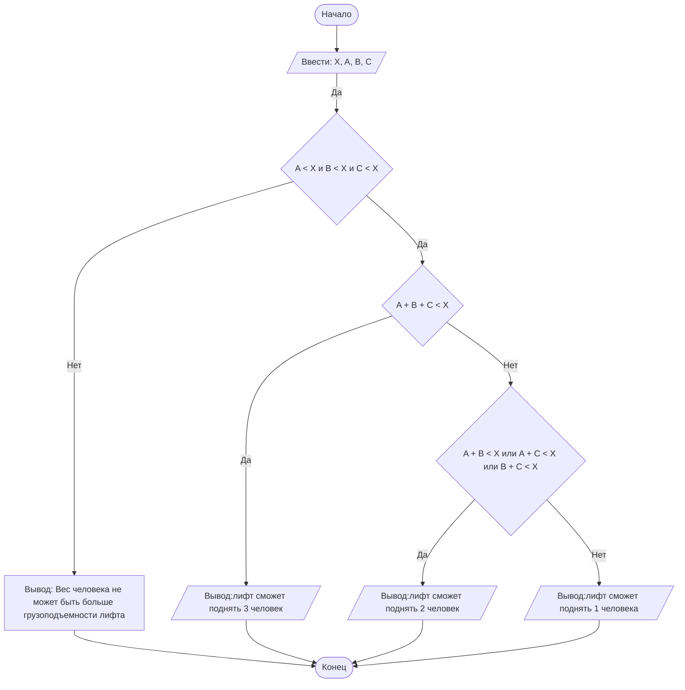

## Отчет по лабораторной работе № 1

#### № группы: `ПМ-2403`

#### Выполнил: `Шашина Софья Андреевна`

#### Вариант: `23`

### Cодержание:

- [Постановка задачи](#1-постановка-задачи)
- [Входные и выходные данные](#2-входные-и-выходные-данные)
- [Выбор структуры данных](#3-выбор-структуры-данных)
- [Алгоритм](#4-алгоритм)
- [Программа](#5-программа)
- [Анализ правильности решения](#6-анализ-правильности-решения)

### 1. Постановка задачи

> В лифте с максимальной грузоподъемностью X кг находятся три человека с весом A, B, C кг.
> Необходимо определить, скольких человек лифт сможет поднять одновременно, не превышая допустимую нагрузку. На вход программы подаются натуральные числа X, A, B, C. 


Данную задачу можно разделить на 2 подзадачи: проверка на корректность условия и сравнение сумм весов людей.

- Для 1 подзадачи нужно чтобы вес каждого человека не превышал грузоподъемность лифта:
    1. `A < X`
    2. `B < X`
    3. `C < X`
- Для 2 подзадачи нужно рассмотреть 2 случая:
    1. `A+C+B <= X` (сумма трех весов людей меньше или равна X)
    2. `A+B <= X или A+C <= X или C+B <= X` (хотя бы одна из сумм двух весов людей меньше или равна X)

### 2. Входные и выходные данные

#### Данные на вход

На вход программа должна получать 4 числа, при этом в условии указано что числа относятся к множеству натуральных чисел, 
а нижние и верхние границы не указаны, так что будем считать нижнюю границу-1, а верхнюю-2^31.

|                      | Тип                | min значение    | max значение   |
|----------------------|--------------------|-----------------|----------------|
| X (Грузоподъемность) | Натуральное число  | 1               | 2<sup>31</sup> |
| A (Вес 1 человека)   | Натуральное число  | 1               | 2<sup>31</sup> |
| B (Вес 2 человека)   | Натуральное число  | 1               | 2<sup>31</sup> |
| С (Вес 3 человека)   | Натуральное число  | 1               | 2<sup>31</sup> |


#### Данные на выход

Т.к. программа должна вывести количество людей, которых сможет поднять лифт, то на выход мы получим единственное целое число, не превышающее 3, т.к. В лифте всего находится трое людей, 
а может получится так, что лифт не поднимет ни одного человека, поэтому минимальное значение 0.


|         | Тип                                | min значение | max значение   |
|---------|------------------------------------|--------------|----------------|
| Число 1 | Целое неотрицательное число        | 0            | 2<sup>31</sup> |

### 3. Выбор структуры данных

Программа получает 4 целых числа, не превышающих по модулю 2^31.
Поэтому для их хранения можно выделить 4 переменных (X,A,B,C) типа int.


|                      | название переменной | Тип (в Java) | 
|----------------------|---------------------|--------------|
| X (Грузоподъемность) | `X`                 | `int`        |
| A (Вес 1 человека)   | `A`                 | `int`        | 
| B (Вес 2 человека)   | `B`                 | `int`        |
| С (Вес 3 человека)   | `C`                 | `int`        |


### 4. Алгоритм

#### Алгоритм выполнения программы:

1. **Ввод данных:**  
   Программа считывает четыре целых числа, обозначенные X, A, B, C.
   
2. **Проверка на коректность условия:**
   Проверяем, что вес человека не больше грузоподъемности лифта(`A`<`X` и `B`<`X` и `C`<`X`).

3. **Сравнение чисел:**  
   Если сумма трех весов людей(`A`+ `B` + `C`), не превышает или равна грузоподъемности лифта, то программа не переходит к следующему шагу.
   Если сумма трех весов людей больше, то программа переходит к следующему шагу и сравнивает  сумму двух весов(`A`+ `B` или `A`+`C` или `B`+`C`) с грузоподъемностью лифта,
   если хотя бы одно из условий соответствует, то программа не переходит к последнему шагу.
   Если все двойки сумм весов людей больше грузоподъемности, то программа переходит к последнему шагу и сразу вывод результат.

4. **Вывод результата:**  
   На экран выводится полученный результат, в зависимости от условий.

#### Блок-схема



### 5. Программа

```java
import java.io.PrintStream;
import java.util.Scanner;
public class Main {
    // Объявляем объект класса Scanner ввода данных
    public static Scanner in = new Scanner(System.in);
    // Объявляем объект класса PrintStream для вывода данных
    public static PrintStream out = System.out;
    public static void main(String[] args) {
        // Считывание четырех целых чисел X, A, B, C из консоли
        int X = in.nextInt();
        int A = in.nextInt();
        int B = in.nextInt();
        int C = in.nextInt();
        //проверяем, что вес человека не больше грузоподъемности лифта
        if (A>X || B>X || C>X)
            out.println("Вес человека не может быть больше грузоподъемности лифта");
        //если вес каждого человека меньше грузоподъемности
        else
            //Сравниваем, сможет ли лифт поднять троих людей
            if (A+B+C<=X)
            // выводим результат, если сможет
                out.print("лифт сможет поднять 3 человек");
            else
            //если лифт не может поднять 3 человек одновременно, то проверяем сможет ли он поднять 2 человек
                if (A+B<=X || B+C<=X || A+C<=X)
                //если сможет, то выводим результат:
                    out.print("лифт сможет поднять 2 человек");
        //если лифт не может поднять 3 или 2 человек, то лифт может перевести только одного человека
        else
            out.print("лифт сможет поднять 1 человека");

    }
}

```

### 6. Анализ правильности решения

Программа работает корректно на всем множестве решений с учетом ограничений.

1. Тест на `A < X и B < X и C < X и A+B+C < X`:

    - **Input**:
        ```
        400 80 72 52 75
        ```

    - **Output**:
        ```
        3
        ```

2. Тест на `A < X и B < X и C < X и A+B <= X`:

    - **Input**:
        ```
        200 105 90 120 
        ```

    - **Output**:
        ```
        2
        ```

3. Тест на `A < X и B < X и C < X и A+C <= X`:

    - **Input**:
        ```
        200 110 120 85 
        ```

    - **Output**:
        ```
        2
        ```

4. Тест на `A < X и B < X и C < X и C+B < X`:

    - **Input**:
        ```
        200 150 110 60
        ```

    - **Output**:
        ```
        2
        ```

5. Тест на коректность условия :

    - **Input**:
        ```
        400 160 450 100 
        ```

    - **Output**:
        ```
        Вес человека не может быть больше грузоподъемности лифта
        ```
